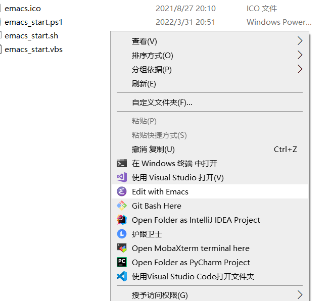

# wsl-emacs-contextmenu

Open Emacs GUI in WSL2 through X server conveniently

Add shortcut and context menu item for Emacs in Windows.

The scripts will start X server automatically.



## Getting Started

1. Copy `emacs_start.sh` to wsl user's home.
2. Edit `powershellScriptPath` in `emacs_start.vbs`.

    ```vbs
    powershellScriptPath="D:\emacs\wsl-emacs-contextmenu\emacs_start.ps1"
    ```

3. Edit some variables in `emacs_start.ps1`.

   ```powershell
    $wslUserName = "smj"
    $xServerPath = "D:/mobaxterm/MobaXterm.exe"
    $xServerProcessName = "mobaxterm"
    $xServerOptions = " -hideterm"
    $wsl = "ubuntu.exe"
   ```

4. Edit paths in `EditWithEmacs.reg`.
5. Import registry `EditWithEmacs.reg`.
6. Copy `Emacs GUI.lnk` to your desktop and modify its property, or create a new shortcut on yourself.
7. if some error occurs, set `visible` in `emacs_start.vbs` to `1` and see what happened.
8. `emacs_start.sh` set some environment variables for the X server,  modify it if you need.
